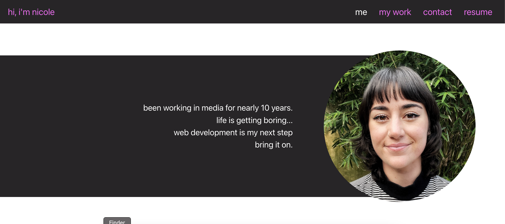
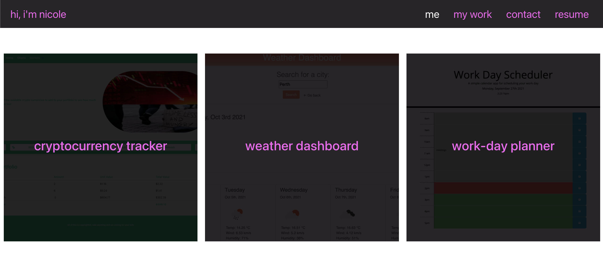

# My Portfolio

## Table of Contents

- [Description](#description)
- [Screenshots](#screenshots)
- [Contact](#contact)
- [Licensing](#licensing)

## Description

My professional portfolio built with React.  

## Screenshots

 

## Contact

For any additional questions or to contact me, you can reach me at: 

- GitHub: [nicoletr](https://github.com/nicoletr)  
- Email: [nicole.trpevski@gmail.com](mailto:nicole.trpevski@gmail.com) 

## Licensing

This project is licensed under [MIT](https://opensource.org/licenses/MIT)
